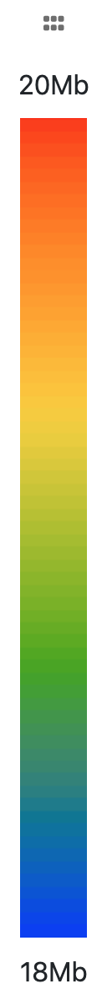

# SpaceWalk

SpaceWalk (index.html) is an application for displaying and interacting with super-resolution chromatin tracing data in 3D. 
SpaceWalk includes [igv.js](https://github.com/igvteam/igv.js) and [juicebox.js](https://github.com/igvteam/juicebox.js) instances for rapid and intuitive visual comparison and interaction between 3D data 
and 1D genomic data.


## Requirements
- Node >= v10.13.0
- NPM >= v6.9.0

## Supported Browsers

SpaceWalk require a modern web browser with support for Javascript ECMAScript 2015.

## Installation
* Clone this repository.
````
git clone git@github.com:igvteam/igv-webapp.git
````
* Install
````
npm install
````
## Build the app
````
npm run build
````
## Run the app
````
npm run start
````
* Open a browser and enter the follow url to run the app
````
localhost:8080/index.html
````

## Getting Started
SpaceWalk is an application for displaying and analysing 3D models of chromatin data.  

Here is a screenshot:


Task-specific interaction panels augment the 3D model to support analysis. 
Panels can be dragged and/or hidden to tailor the interface for the type of analysis required:


There are three rendering styles for 3D data. All rendering styles involve using a color ramp to map genomic location to 3D. For details on this color ramp see Color Ramp Genomic Navigator below

#### Noodle

A tube is rendered that interpolates between chromatin centroids. The tube is colored with a color ramp indication genomic location.


#### Ball & Stick

Centroids are rendered as balls each colored according to it's genomic location. Cylinders connect the balls in the order then appear in the genomic range.


#### Point Cloud
Centroids are rendered as 3D points. Clusters of points are colored according to their genomic location.


Here is a description of the panels
#### Color Ramp Genomic Navigator



Place the cursor over this panel and move vertically to navigate through the genomic range indicated by the labels at top and bottom.
As you move the corresponding section of the 3D model is indicated. 
#### Trace Selector
#### Juicebox
#### IGV
#### Distance Map
#### Contact Frequency Map


#### Depricated Documentation
- Using the top palette browse for a csv Segment files (in resource/csv). Click "Load File" to load it into the app
- Rotate/Zoom the 3D model that loads. Use the
- See the left hand palette covered with a grid of dots. Each dot corresponds to a different segment section. Mouse across to rapidly move between then. Click a dot to select.
- See the pallete with the color ramp at right. mouse vertically over the color ramp to select different genomic regions and notice the corresponding 3D segment location highlighted. Alternatively 
mouse over the spheres to highlight the color ramp. 
- See the palette at the bottom of the screen. This is an igvjs instance. See the loaded track. Select a different track URL via the input dialog above the track.
