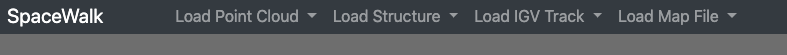
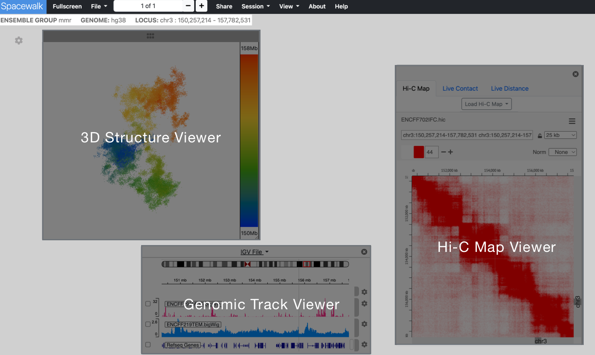
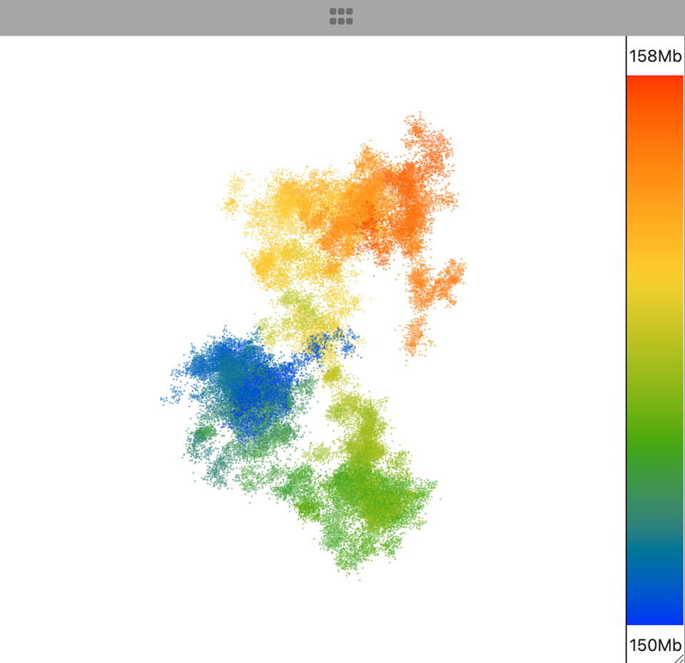
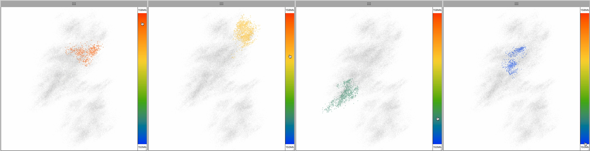
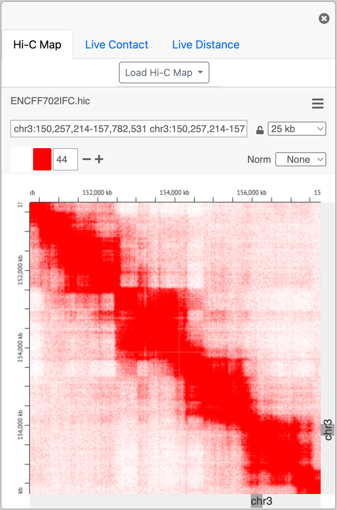
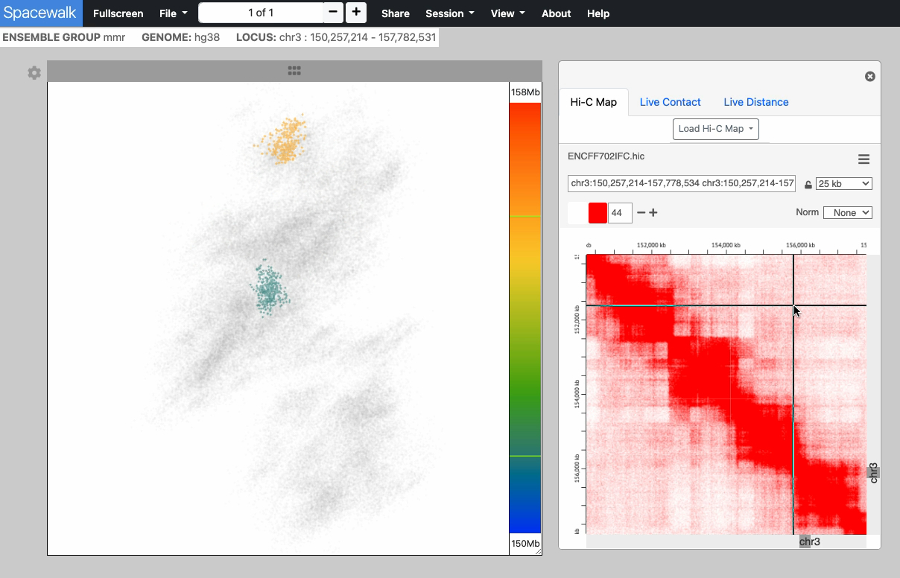
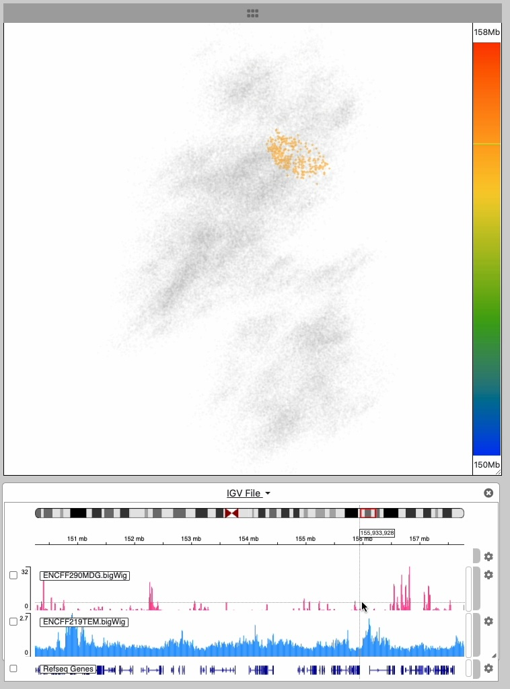
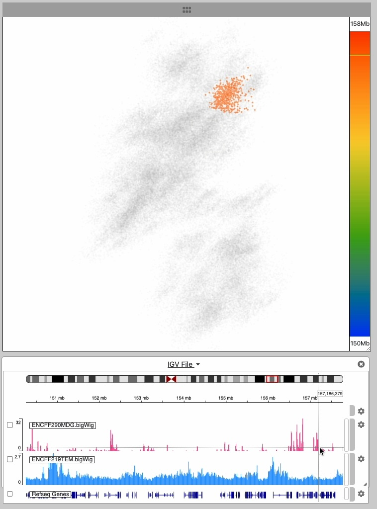

## Spacewalk

Spacewalk provides interactive 3D visualization of super-resolution microscopy data, 
with integrated genomic analysis via the genomics browser [igv.js](https://github.com/igvteam/igv.js) 
and the Hi-C map viewer [juicebox.js](https://github.com/igvteam/juicebox.js)

Spacewalk is hosted at [Aiden Lab](https://aidenlab.org/) here [Spacewalk](https://aidenlab.org/spacewalk/). To install your own version of Spacewalk follow these steps:

### Requirements
- Node >= v20.8.0
- NPM >= v10.1.0

### Supported Browsers

Spacewalk require a modern web browser with support for Javascript ECMAScript 2015.

### Installation
* Clone this repository.
````
git clone https://github.com/igvteam/spacewalk.git
````
* Change directory to spacewalk
````
cd spacewalk
````
* Install
````
npm install
````
### Build the app
````
npm run build
````
### Launch the app
````
npm run start
````
* Open a browser and enter the follow url to launch the app
````
localhost:8080/index.html
````

After launching the app, you will see a screen with a single empty 3D viewer. In the navbar use the **File** dropdown menu to load 3D structure into the 3D viewer.



Spacewalk supports the 3D visualization of
- Super-resolution microscopy (SRM) data
- Chromatin simulations
- Other forms of genome microscopy and spatial genomics

Spacewalk supports 3D visualization of data that comes in two general forms:
- Point Cloud - Typically derived from OlioSTORM data
- Ball & Stick - Typically derived from Chromatin simulations

#### Point Cloud
The point cloud is rendered as a collection of 3D point clusters, each corresponding to a specific genomic extent.
The color of each cluster is determined by the genomic navigator's color ramp bar, located on the right side of the 3D viewer.

When you mouse over the genomic navigator the corresponding 3D point cluster is highlighted.


#### Ball & Stick
Chromatin centroids are rendered as balls, each colored according to its genomic location.
Sticks (cylinders) connect the balls in the order they appear along the genomic range.
As the user moves the cursor along the genomic navigator on the right side of the 3D viewer,
the corresponding ball is highlighted based on its genomic location.

Alternatively, hovering over a ball will display its genomic location in the genomic navigator's
color ramp.


## Spacewalk in Detail



Spacewalk is organized around three visualization panels, each responsible for one aspect of genomic visualization:
#### 3D Structure Viewer
A 3D structure - SRM, simulation, etc. - is loaded by clicking on the **File** dropdown menu in the navbar

<table>
  <tr>
    <!-- Image on the left -->
    <td style="width: 50%; vertical-align: top;">
      
    </td>
    <!-- Text on the right -->
    <td style="width: 50%; padding-left: 15px; vertical-align: top;">
      <p>
        The 3D structure we visualize represents the spatial folding of a chromosome. 
        3D interaction is inherently linked to the 1D genomic coordinate system of base pairs.
        The vertical color bar at right is used to establish a visual and interactive link
        between 3D space and genomic space. As the user moves the cursor over the color bar
        a region of the 3D structure is highlighted based on it’s corresponding genomic location
        in the color bar.
    </p>
    </td>
  </tr>
</table>

This image series shows the cursor moving along the genomic extent of the 3D structure. 
Notice the highlighting of the 3D structure during the interaction


#### Hi-C Map Viewer
An embedded instance [juicebox.js](https://github.com/igvteam/juicebox.js) for viewing Hi-C maps

<table>
  <tr>
    <!-- Image on the left -->
    <td style="width: 50%; vertical-align: top;">
      
    </td>
    <!-- Text on the right -->
    <td style="width: 50%; padding-left: 15px; vertical-align: top;">
      <p>
        The Hi-C map shows the frequency of contact between different parts of the chromosome. 
        In the series of images that follow, the highlighted locations on the 3D structure show 
        where those contacts occur on the 3D structure. This linked interaction establishes a 
        powerful visual correspondence between these two aspects of the 3D structure: adjacency 
        and spatial location.
    </p>
    </td>
  </tr>
</table>




#### Genomic Track Viewer
An embedded instance of the [igv.js](https://github.com/igvteam/igv.js) genome browser

<table>
  <tr>
    <!-- Image on the left -->
    <td style="width: 50%; vertical-align: top;">
      
    </td>
    <!-- Text on the right -->
    <td style="width: 50%; padding-left: 15px; vertical-align: top;">
      <p>
        The IGV browser has a pair of tracks showing histone modifications from ChIP-seq data displayed 
        as a bar chart of signal intensities. In the series of image below, as the cursor moves across 
        the IGV track notice how the corresponding genomic location on the 3D structure is highlighted.
    </p>
    </td>
  </tr>
</table>






