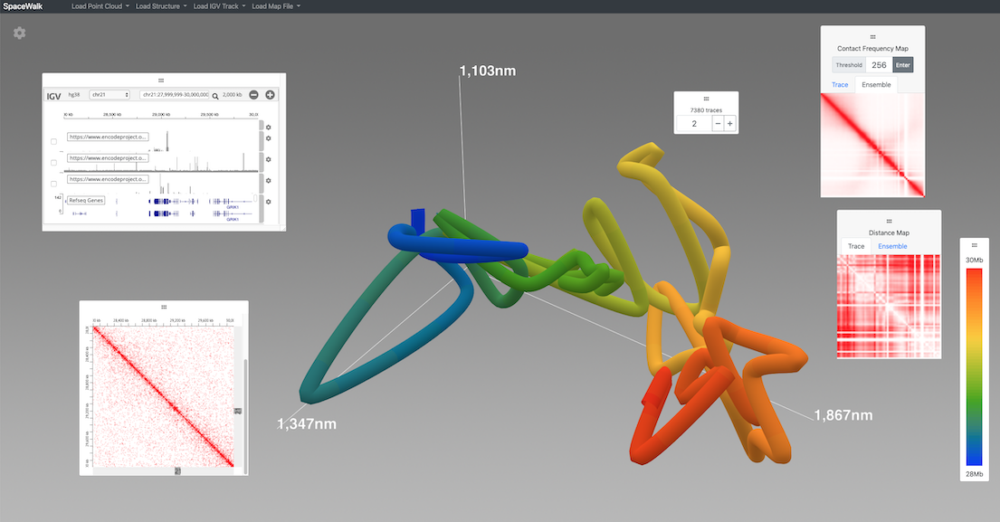
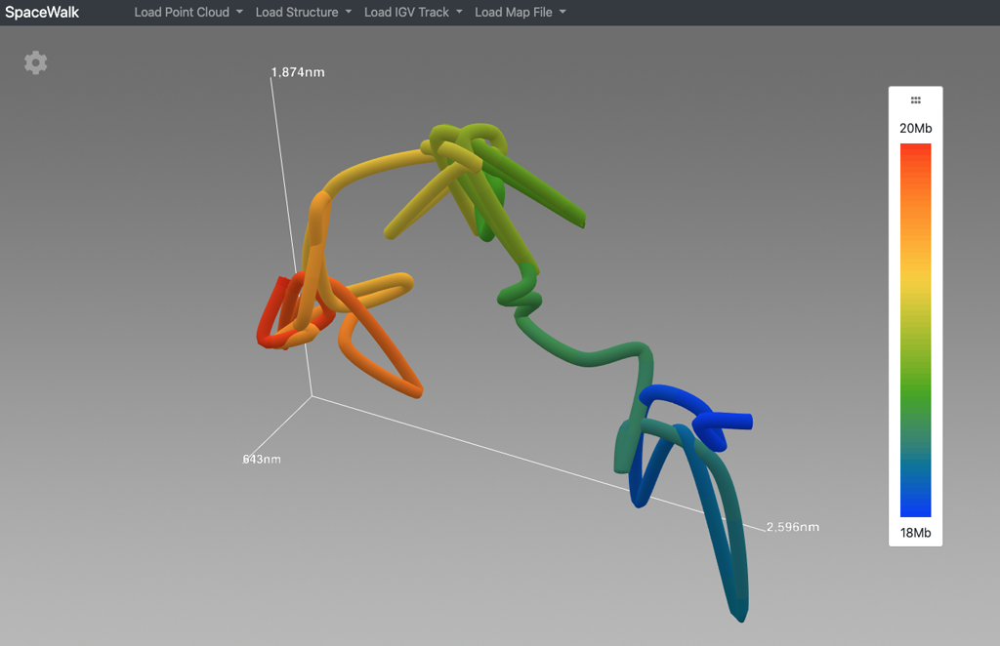
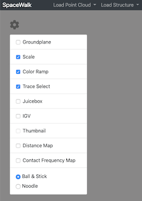
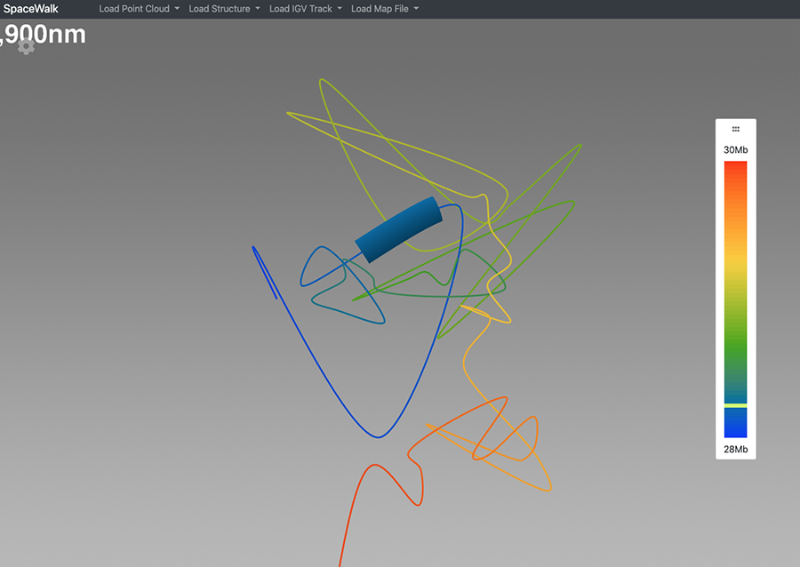
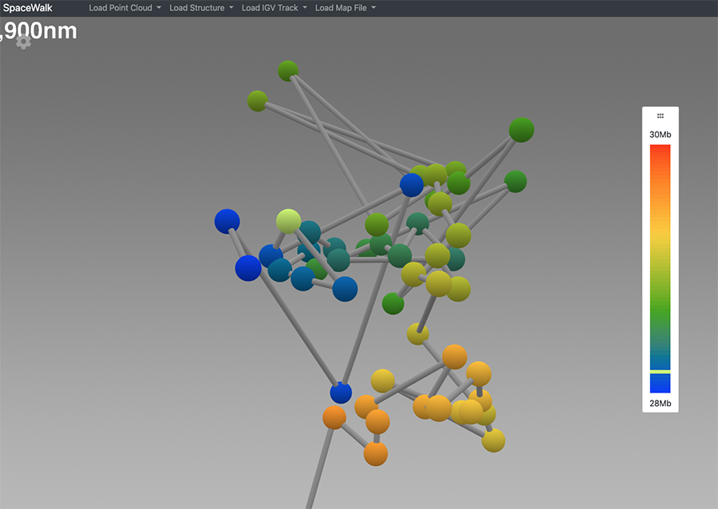
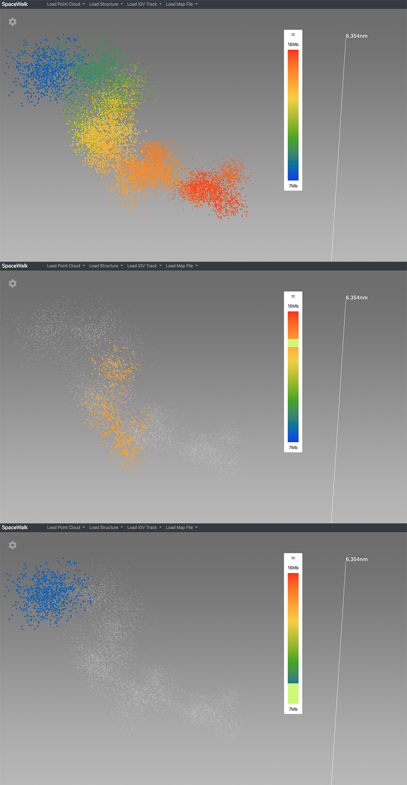
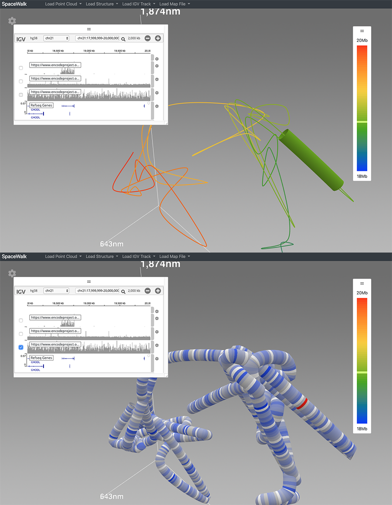
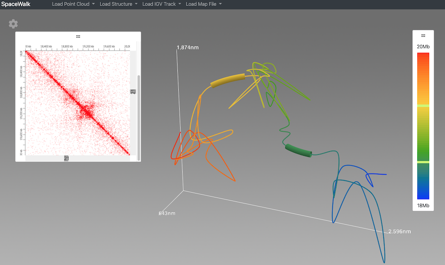

# Spacewalk



Spacewalk is an application for displaying and interacting with super-resolution chromatin tracing data in 3D. 
Spacewalk includes [igv.js](https://github.com/igvteam/igv.js) and [juicebox.js](https://github.com/igvteam/juicebox.js) 
instances for rapid and intuitive visual comparison and interaction between 3D data and 1D genomic data.

## Requirements
- Node >= v10.13.0
- NPM >= v6.9.0

## Supported Browsers

Spacewalk require a modern web browser with support for Javascript ECMAScript 2015.

## Installation
* Clone this repository.
````
git clone git@github.com:igvteam/spacewalk.git
````
* Install
````
npm install
````
## Build the app
````
npm run build
````
## Run the app
````
npm run start
````
* Open a browser and enter the follow url to run the app
````
localhost:8080/index.html
````

## Getting Started
After launching the app. You will see a blank 3D space. Use one of the dropdown menus in the navbar to load either a point cloud or a segment list dataset.


Spacewalk supports loading files of various types:
- Point Cloud - Each file contains a list of point clusters. Each cluster corresponds to a genomic range.
- Segment List - Each file contains a list of traces. Each trace contains a list of segments. Each segment is a genomic range.
- IGV Tracks - Track files consumed by the IGV panel. Refer to the track section of the [igv.js wiki](https://github.com/igvteam/igv.js/wiki/Tracks-2.0)
- Juicebox Contact Maps - Refer to the [Aiden Lab](http://www.aidenlab.org/index.html) website for details.

Three rendering styles are supported. All rely on the use of color to map genomic location to 3D.

#### Noodle

A tube is rendered that interpolates between a list of chromatin centroids. Color along the length of the tube corresponds to genomic location. 
The genomic navigator - described above - is used to identify and highlight genomic regions.



#### Ball & Stick

A list of chromatin centroids are rendered as balls. Each ball is colored according to it's genomic location. Sticks (cylinders) connect balls in the order they appear in the genomic range.
The genomic navigator - described above - is used to identify each ball and highlight genomic regions. 
Alternatively, mouse over a ball to see it's genomic location in the genomic navigator's color ramp.


#### Point Cloud
Centroid point clouds are rendered as 3D points. Points associated with a particular genomic range are colored based on the genomic navigator color ramp.
Mouse over the genomic navigator to isolate clusters of points for that genomic range. 


Click the gear icon at upper left to show/hide a panel. Panels can be repositioned by dragging. 


 
 These task-specific interaction panels support analysis of the 3D data. 
 


The panels include:
- Trace Select. A widget to navigate between the set of traces that comprise an ensemble.

- Genomic Navigator. The genomic range for a given trace is represented by a color ramp.
Mouse over this color ramp to highlight the corresponding genomic location in the 3D trace structure.

    - Noodle highlighting. A sub-section of the noodle corresponding to the genomic region is isolated

    

    - Ball & Stick highlighting. The ball corresponding to the genomic region is highlighted.

    

    - Point Cloud highlighting. The point cloud cluster corresponding to the genomic region remains colored all other
    clusters are deemphasized. The size of the highlight in the genomic navigator corresponds to the relative size of
    the genomic region.

    

- IGV. A fully functional IGV.js application. The app has been extended to enable interaction with the 3D model.
On the left, mousing across a track behaves similar to the genomic navigator. On the right we have selected a track. The
features are automatically mapped to the 3D model. Now mousing across the mapped track shows a sliding red ring on the 3D
model indicating genomic location.



- Juicebox. A fully functional Juicebox.js application. The app has been extended to enable interaction with the 3D model.
Mouse over the contact map to highlight the corresponding genomic locations on the 3D model.



- Distance Map. An ensemble level and trace level distance map created on the fly when an ensemble file is loaded.

- Contact Frequency Map. An ensemble level and trace level contact frequency map created on the fly when an ensemble file is loaded.

