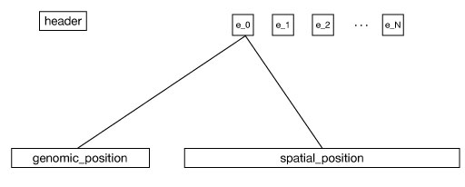
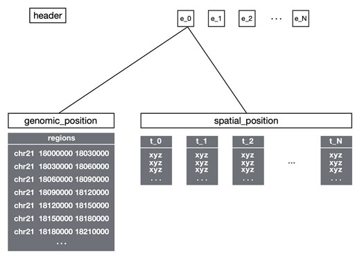
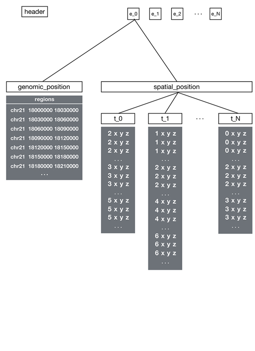

# File Structure and Organization

The Spacewalk binary file format is based on the Hierarchical Data Format [HDF5](https://www.hdfgroup.org/solutions/hdf5).

## HDF5 Concepts

Key HDF5 concepts used in the .sw format are:
- **Group**: The HDF5 analog to a directory or folder of a file system
- **Dataset**: An M by N array that stores a particular chunk data in the file
- **Attributes**: A property of groups and datasets that enables optional storage of associated metadata as key/value pairs

Since the .sw format is a valid HDF5 file, the contents can be examined by any general HDF5 viewer, such as [myHDF5](https://myhdf5.hdfgroup.org/).

## File Organization

The file contains:

### 1. Header Group

Must be named `header` with required metadata:

| Key       | Value                           |
|-----------|---------------------------------|
| format    | "sw"                           |
| genome    | A valid genimd id. e.g., "hg19" |
| pointtype | "SINGLE_POINT" or "MULTI_POINT" |

### 2. Ensemble Groups

Each ensemble group contains data for a single experiment with:
- Unique names (except "header")
- Optional "name" attribute
- Two child groups: `genomic_position` and `spatial_position`

## Data Types

### Single Point Data
- One XYZ point per genomic region
- Used for centroid-based visualization
- Supports ball-and-stick rendering

### Multi Point Data
- Multiple XYZ points per genomic region
- Used for point cloud visualization
- Supports density-based rendering

