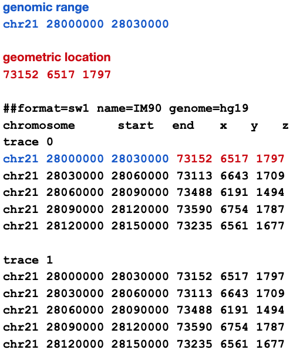
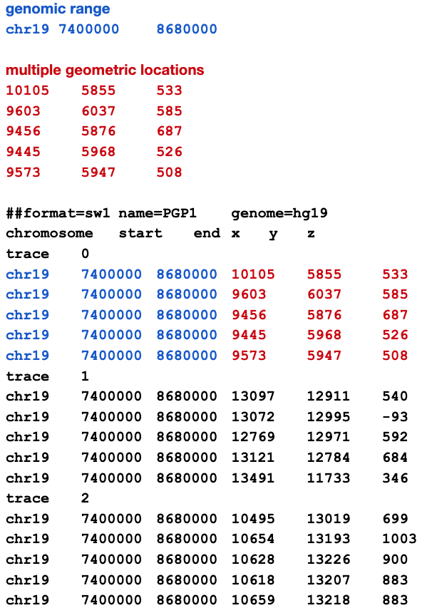

# Legacy Spacewalk Text Format

The legacy text-based format (`.swt`) is now deprecated. Use the [swt2sw](https://github.com/turner/swt2sw) tool to migrate to the new `.sw` format.

## Format Specification

### File Structure

1. **First Line**: Format directive with key-value properties
   - Format specifier (required)
   - Name (required)
   - Genome identifier (required, e.g., hg38, GRCh38)

2. **Second Line**: Six column headings, whitespace-delimited

3. **Remaining Lines**: Blocks of trace data
   - Each block begins with a "trace" line
   - Followed by data lines
   - All tokens are whitespace delimited

## Example Formats

### Ball & Stick Data (ORCA)
Each record links a geometric location with a genomic range:



### Point Cloud Data (OligoSTORM)
Multiple geometric locations can share the same genomic range:



## Migration

To convert legacy `.swt` files to the new `.sw` format:

1. Install the migration tool:
   ```bash
   pip install swt2sw
   ```

2. Convert your files:
   ```bash
   swt2sw input.swt output.sw
   ```
