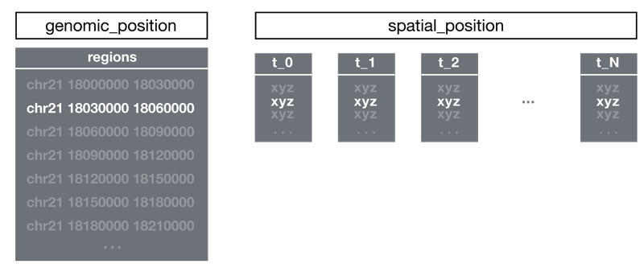

# Format Specification

## Overview

The Spacewalk binary file format (.sw) uses HDF5 to store and organize genomic spatial data. The format supports both single-point (centroid) and multi-point (cluster) data types.

## File Structure

### Header Group
Required top-level group named `header` with metadata:

| Key       | Value                           |
|-----------|---------------------------------|
| format    | "sw"                           |
| genome    | A valid genimd id. e.g., "hg19" |
| pointtype | "SINGLE_POINT" or "MULTI_POINT" |

### Genomic Position
The `genomic_position` group contains:

- **regions** dataset: 2D array with columns:
  - chromosome name (string)
  - region start (integer, bp)
  - region end (integer, bp)

Regions must be sorted by genomic start position.

### Spatial Position
The `spatial_position` group contains XYZ data in two possible formats:

#### Single Point Format
- One XYZ point per genomic region
- Datasets named `t_0`, `t_1`, etc. for each trace
- Direct 1:1 mapping between regions and points

#### Multi Point Format
- Multiple XYZ points per genomic region
- Trace groups named `t_0`, `t_1`, etc.
- Each row format: `region_index x y z`
- Flexible mapping between regions and points

## Example Files

View example files in HDF5 format:
- [Single Point Example](https://myhdf5.hdfgroup.org/view?url=https%3A%2F%2Fgithub.com%2Fturner%2Fswt2sw%2Fblob%2Fmain%2Fball-and-stick.sw)
- [Multi Point Example](https://myhdf5.hdfgroup.org/view?url=https%3A%2F%2Fgithub.com%2Fturner%2Fswt2sw%2Fblob%2Fmain%2Fpointcloud-missing-genomic-regions.sw)
