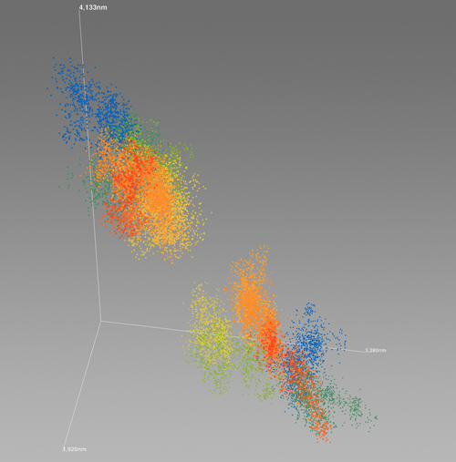
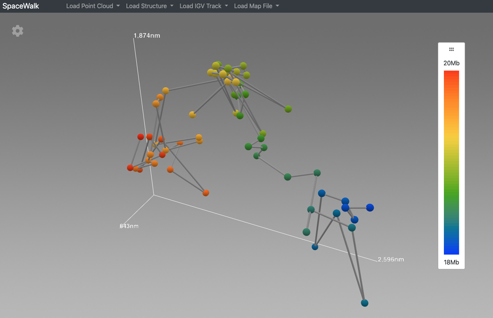

# Spacewalk Documentation

Welcome to Spacewalk! Spacewalk is an interactive 3D visualization application for super-resolution microscopy data, featuring seamless integration with IGV genomics browser and Juicebox Hi-C map viewer.

 **[Launch Spacewalk Application](https://aidenlab.org/spacewalk/)**

## Quick Start Guide

1. Open [Spacewalk](https://aidenlab.org/spacewalk/)
2. Use the **File** dropdown menu to load your 3D structure into the viewer
3. Choose your preferred visualization mode:
   - **Point Cloud**: For viewing 3D point clusters of OlioSTORM data
   - **Ball & Stick**: For viewing chromatin centroids with connecting cylinders

## Features

- Interactive 3D visualization of:
  - Super-resolution microscopy (SRM) data
  - Chromatin simulations
  - Other forms of genome microscopy and spatial genomics
- Real-time interaction between genomic coordinates and 3D structure
- Integrated genome browser and Hi-C map visualization

## Visualization Modes

### Point Cloud
The point cloud renders 3D point clusters, each corresponding to a specific genomic extent. Colors are determined by the genomic navigator's color ramp bar. Mouse over the genomic navigator to highlight corresponding 3D point clusters.

### Ball & Stick
This mode displays chromatin centroids as balls connected by cylindrical sticks. Each ball is colored according to its genomic location. Moving your cursor along the genomic navigator highlights the corresponding structures in the 3D view.

## Need Help?

- Check out our [User Guide](user-guide.md) for detailed instructions
- Visit our [FAQ](faq.md) for common questions
- For technical issues, please [report them on GitHub](https://github.com/igvteam/spacewalk/issues)
