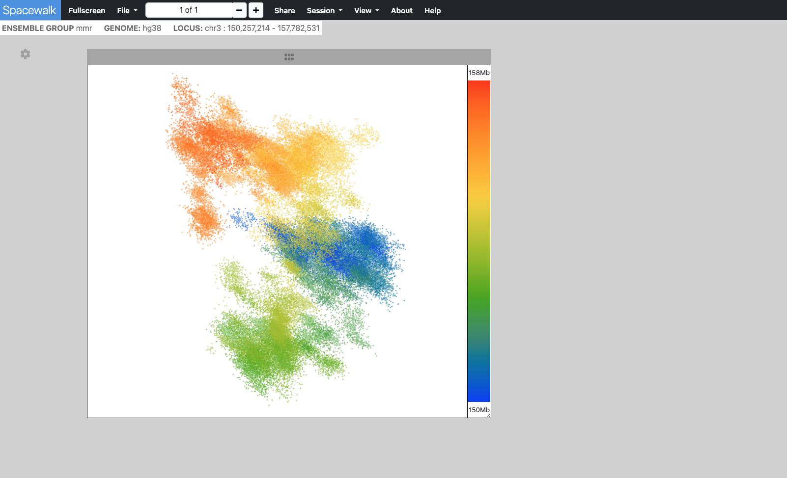

# Spacewalk Documentation

Spacewalk is an interactive 3D visualization application for super-resolution microscopy data, featuring seamless integration with IGV genomics browser and Juicebox Hi-C map viewer.

**[Launch Spacewalk Application](https://aidenlab.org/spacewalk/)**

## Overview

Spacewalk enables scientists to:
- Visualize and explore 3D genomic structures
- Interact with super-resolution microscopy data
- Connect genomic coordinates with spatial organization
- Analyze chromatin folding patterns

## Quick Start

1. Launch [Spacewalk](https://aidenlab.org/spacewalk/)
2. Use the **File** dropdown menu to load your 3D structure
3. Explore your data through our interactive viewers:
   - 3D Structure Viewer
   - Hi-C Map Viewer
   - Genomic Track Viewer

For detailed instructions and features, visit our [User Guide](user-guide).

## Example Visualization

*Example of Spacewalk's Point Cloud visualization mode showing 3D genomic structure*
