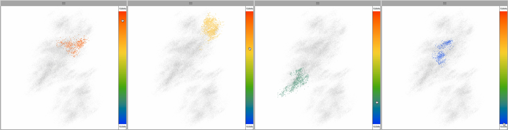
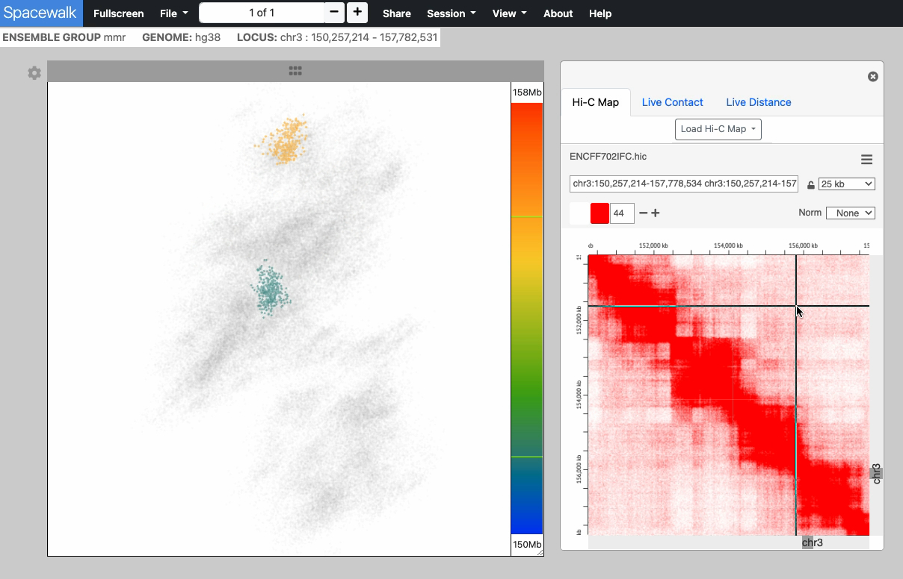
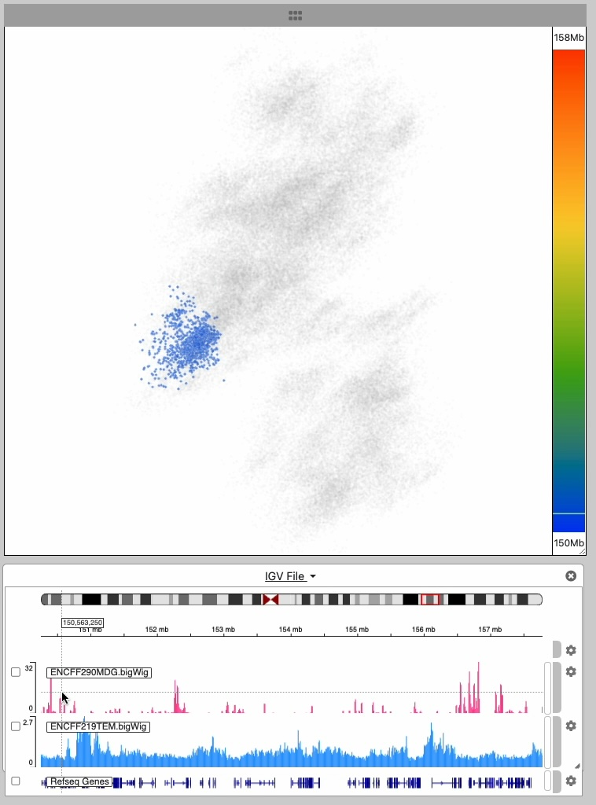
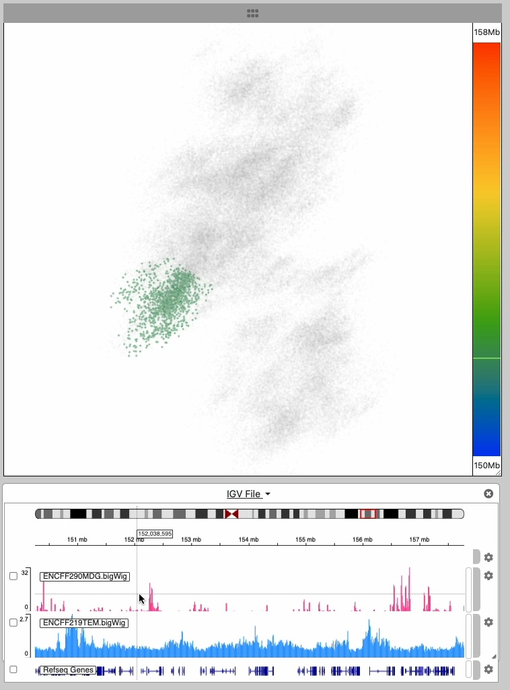
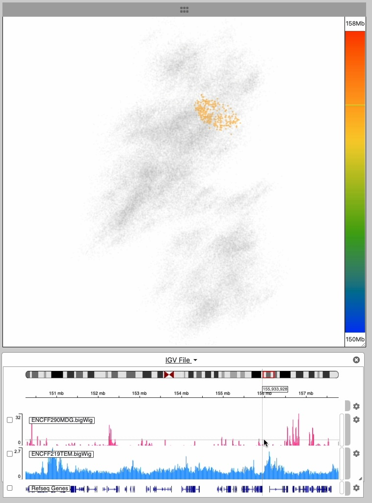
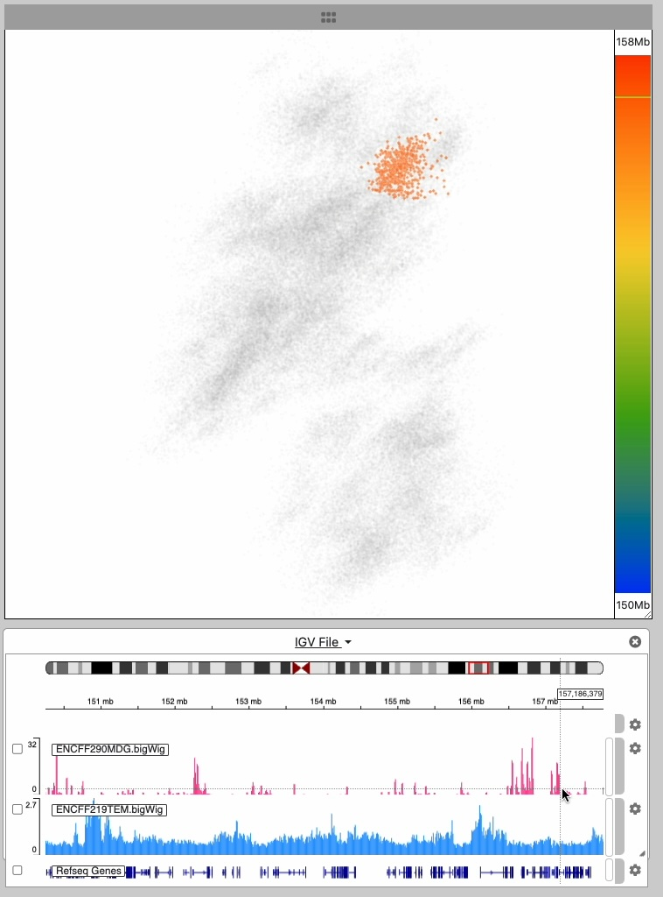

# Interface Components

Spacewalk is organized around three main visualization panels, each providing a unique perspective on your genomic data.

## 3D Structure Viewer

The 3D structure represents the spatial folding of a chromosome. 3D interaction is inherently linked to the 1D genomic coordinate system of base pairs.
The vertical color bar at right establishes a visual and interactive link between 3D space and genomic space.

As you move the cursor over the color bar, a region of the 3D structure is highlighted based on its corresponding genomic location:

## Hi-C Map Viewer

The Hi-C map shows the frequency of contact between different parts of the chromosome. The highlighted locations on the 3D structure show 
where those contacts occur on the 3D structure. This linked interaction establishes a powerful visual correspondence between these two aspects 
of the 3D structure: adjacency and spatial location.

## Genomic Track Viewer

The IGV browser displays tracks showing histone modifications from ChIP-seq data as a bar chart of signal intensities. 
As you move your cursor across the IGV track, the corresponding genomic location on the 3D structure is highlighted:

