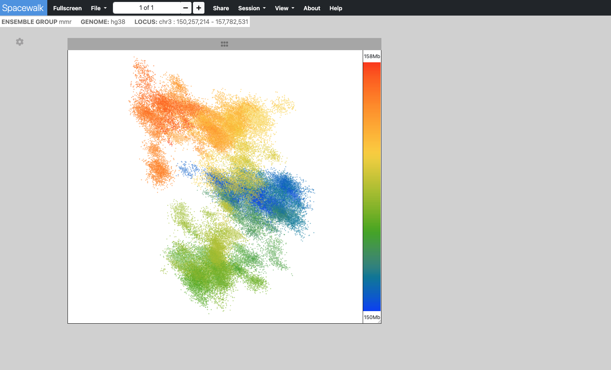

# Visualization Modes

Spacewalk offers two powerful visualization modes to explore your data.

## Point Cloud Mode

The point cloud is rendered as a collection of 3D point clusters, each corresponding to a specific genomic extent.
The color of each cluster is determined by the genomic navigator's color ramp bar, located on the right side of the 3D viewer.
When you mouse over the genomic navigator the corresponding 3D point cluster is highlighted.

### Use Cases
- Viewing OlioSTORM data
- Exploring dense point cluster distributions
- Analyzing spatial relationships in high-resolution data

## Ball & Stick Mode

Chromatin centroids are rendered as balls, each colored according to its genomic location.
Sticks (cylinders) connect the balls in the order they appear along the genomic range.
As the user moves the cursor along the genomic navigator on the right side of the 3D viewer,
the corresponding ball is highlighted based on its genomic location.

### Use Cases
- Visualizing chromatin structure
- Following genomic paths in 3D space
- Understanding connectivity between regions
