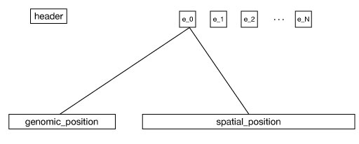
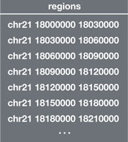
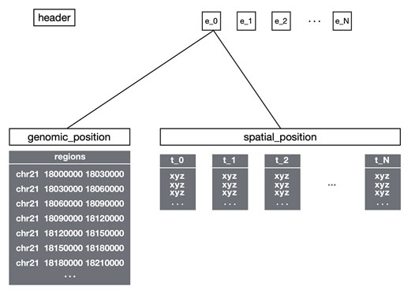
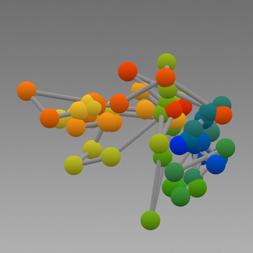
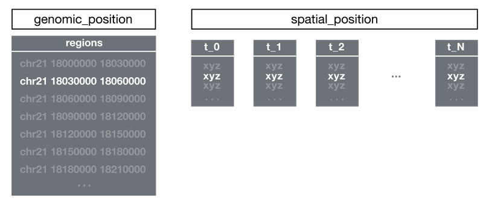
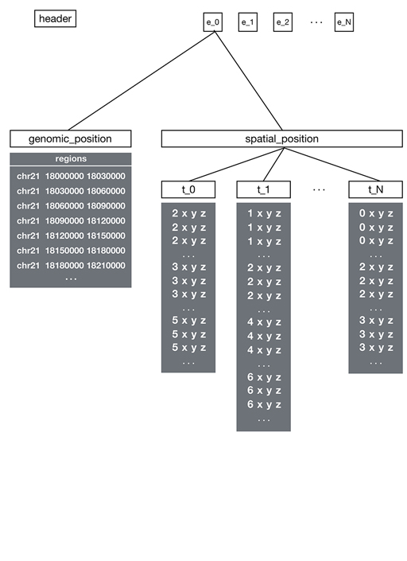
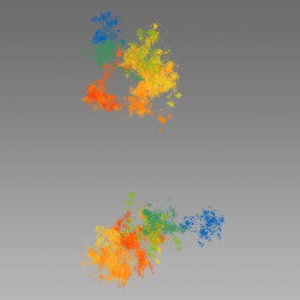

# Spacewalk File Format

## 1. Overview
The Spacewalk binary file format (.sw) is an extensible format for the visualization of 3D genomic data with the
[Spacewalk visualization tool](https://github.com/igvteam/spacewalk?tab=readme-ov-file#readme). The file stores spatial data associated with genomic regions from one or more
experiments or ensembles. Each experiment has spatial data for multiple traces. Typical datasets include super-resolution chromatin tracing data and genomic simulation data.

The Spacewalk Binary File Format (.sw) is designed to provide:

- **Optimized Performance:**  
  Efficient I/O is enabled by using streaming technology built atop the HDF5 file format.

- **Scalability:**  
Can accommodate very large datasets with little or no degradation in performance as file size scales up.

### Deprecated Legacy Format

The legacy text-based format (.swt) is no longer supported. A migration tool - [swt2sw](https://github.com/turner/swt2sw) - is provided 
for transition to the .sw format. Documentation of the legacy file format is [here](Legacy-Spacewalk-Text-Format.md)


### Google Colab Notebook - Convert CSV data to Spacewalk File Format
Included in the [swt2sw](https://github.com/turner/swt2sw) project is a Google Colab Notebook that is a detailed example of how to convert a simple
CSV file to Spacewalk Binary File format. Click this button to run the notebook
[](https://colab.research.google.com/github/turner/swt2sw/blob/main/docs/CSVtoSpacewalk.ipynb)


## 2. File Structure and Organization
The Spacewalk binary file format is based on the Hierarchical Data Format [HDF5](https://www.hdfgroup.org/solutions/hdf5). Key HDF5 concepts used in the .sw format are:
- **Group**: The HDF5 analog to a directory or folder of a file system.
- **Dataset**: An M by N array that stores a particular chunk data in the file.
- **Attributes**: A property of groups and datasets that enables optional storage of associated metadata as key/value pairs.

Note that since the .sw format is a valid HDF5 file, the contents of a file can be examined by any general HDF5 viewer,
such as [myHDF5](https://myhdf5.hdfgroup.org/).

The following schematic shows the groups that make up the .sw file format.



At the top level of the hierarchy are (1) a header group that contains global metadata for the file,
and (2) one or more groups that contain the data for one or more ensembles or experiments.
1) The **header group** must be named `header`. Its attribute property must have the following key value pairs of required
   metadata

| Key       | Value                           |
|-----------|---------------------------------|
| format    | "sw"                           |
| genome    | A valid genimd id. e.g., "hg19" |
| pointtype | "SINGLE_POINT" or "MULTI_POINT" |

The format allows other key/value pairs to be present in the header, but the Spacewalk application will ignore them.

2) Each **ensemble group** contains the data for a single experiment or ensemble. The groups must have unique names, but they can be any string except "header". In the schematic above, they are named `e_0`, `e_1`, etc. Each group has an optional attribute:

| Key  | Value                                                                                                                                                                                                          |
|------|----------------------------------------------------------------------------------------------------------------------------------------------------------------------------------------------------------------|
| name | The name can be any string. If no name is provided <br/>the ensemble group name will be used instead. <br/>The Spacewalk application uses this name to list <br/>the available ensembles if there is more than one. |

The ensemble group is parent to two child groups named `genomic_position` and `spatial_position`.

### Genomic Position
The `genomic_position` group stores information about the genomic regions. It contains a single dataset named `regions`
which is a two-dimensional array. Each row is a genomic region and has three elements:
* chromosome name (string),
* genomic region start (integer representing genomic coordinates in bp), and
* genomic region end (integer representing genomic coordinates bp).

The regions must be sorted by genomic region start. Here is an example `regions` dataset:



### Spatial Position
The `spatial_position` group contains XYZ datasets associated with the genomic regions in the `regions` dataset.
Depending on the type of experiment a .sw file is derived from, each genomic region in a `regions` dataset will have either
a single XYZ point associated with it or a cluster of XYZ points associated with it. The `pointtype` attribute
in the `header` group specifies "SINGLE_POINT" or "MULTI_POINT" accordingly.

#### Single Point
For a "SINGLE_POINT" file, the `spatial_position` group contains one XYZ dataset per trace.
The datasets are named **t** followed by an underscore (**_**) followed by an integer number that indicates the trace
number. The first trace dataset is named `t_0` and subsequent traces are `t_1`, `t_2`, etc. Each dataset establishes
a one-to-one correspondence between one genomic region and one XYZ point. The number of points must be the same as the number of regions.

The following figure shows an example file format diagram on the left and a screenshot of a Spacewalk ball-and-stick rendering of a
**SINGLE_POINT** file on the right. Each ball represents the point for a region; the balls are connected by sticks to indicate the order of the regions.

_Click the file format diagram for a larger view. Click the Spacewalk rendering screenshot for a live, interactive session
with the app._

<table>
  <tr>
    <td><a href="img/hdf5-structure-ball-stick.png" target="_blank"></a></td>
    <td><a href="https://tinyurl.com/26nef3oj" target="_blank"></a></td>
  </tr>
</table>

The following schematic illustrates the association between the row 1 of the `regions` dataset and row 1 of each single-point XYZ trace dataset:



An example single_point file loaded into the HDF5 file viewer: [myHDF5](https://myhdf5.hdfgroup.org/view?url=https%3A%2F%2Fgithub.com%2Fturner%2Fswt2sw%2Fblob%2Fmain%2Fball-and-stick.sw)

#### Multi Point

For a  **MULTI_POINT** file the `spatial_position` group contains traces that are represented as groups named **t** followed by an underscore (**_**)
followed by an integer number that indicates the trace number. The first trace group is named `t_0` and subsequent traces are `t_1`, `t_2`, etc.
Each trace group contains a single dataset, each row of this dataset is a 4-tuple with the following layout:

**region_index x y z**

The `region_index` is an index into the `regions` dataset.

The dataset contains all region indices and associated xyz clusters
for the trace. The following figure shows an example file format diagram on the left and a screenshot of a Spacewalk point-cloud rendering of a
multi-point file on the right. Each colored cluster of XYZ points corresponds to a different genomic region. Notice the difference
between the region indices between the traces. This is to indicate that there is no requirement that all traces have all region ids.

_Click the file format diagram for a larger view. Click the Spacewalk rendering screenshot for a live, interactive session with the app._

<table>
  <tr>
    <td><a href="img/hdf5-structure-pointcloud.png" target="_blank"></a></td>
    <td><a href="https://tinyurl.com/29nce5ds" target="_blank"></a></td>
  </tr>
</table>

An example multi_point file loaded into the HDF5 file viewer: [myHDF5](https://myhdf5.hdfgroup.org/view?url=https%3A%2F%2Fgithub.com%2Fturner%2Fswt2sw%2Fblob%2Fmain%2Fpointcloud-missing-genomic-regions.sw)


## 3. Streaming Spacewalk Files with `hdf5-indexer`

To optimize data retrieval and enable efficient streaming of large `.sw` files, the [`hdf5-indexer`](https://github.com/jrobinso/hdf5-indexer) tool is utilized. This tool creates an index mapping each dataset's path within the HDF5 file to its corresponding file offset. By embedding this index into the `.sw` file, applications can directly access specific datasets without traversing the entire file hierarchy, significantly improving performance.

**Integrating `hdf5-indexer` into the Spacewalk Workflow**

To incorporate `hdf5-indexer` into your Spacewalk workflow, follow these steps:

1. **Install `hdf5-indexer`:**

   ```bash
   pip install git+https://github.com/jrobinso/hdf5-indexer.git
   ```

2. **Indexing an `.sw` File:**

   After creating or obtaining a Spacewalk binary file (e.g., `example.sw`), generate and embed the index:

   ```bash
   h5index example.sw
   ```

   This command processes `example.sw`, creates the index, and appends it as a top-level dataset named `_index`.

3. **Verifying the Embedded Index:**

   To confirm that the index has been correctly embedded:

   ```bash
   h5extract example.sw
   ```

   This command extracts and displays the `_index` dataset, allowing you to verify its presence and accuracy.

**Benefits of Using `hdf5-indexer` with Spacewalk Files**

- **Efficient Data Access:** The embedded index allows for direct retrieval of specific datasets without the need to navigate the entire file structure.

- **Improved Performance:** Particularly advantageous for large `.sw` files, the index enhances data streaming capabilities, making it ideal for web-based visualization and analysis.

- **Seamless Integration:** The `hdf5-indexer` tool complements the existing HDF5-based `.sw` format, requiring minimal changes to existing workflows while providing substantial performance gains.

By integrating `hdf5-indexer` into your Spacewalk data management process, you can achieve faster and more efficient access to complex 3D genomic datasets, facilitating enhanced visualization and analysis. 
