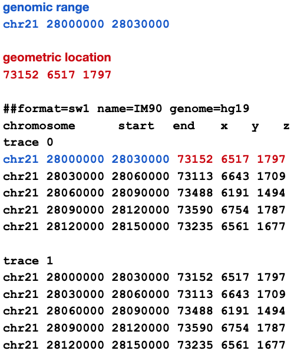
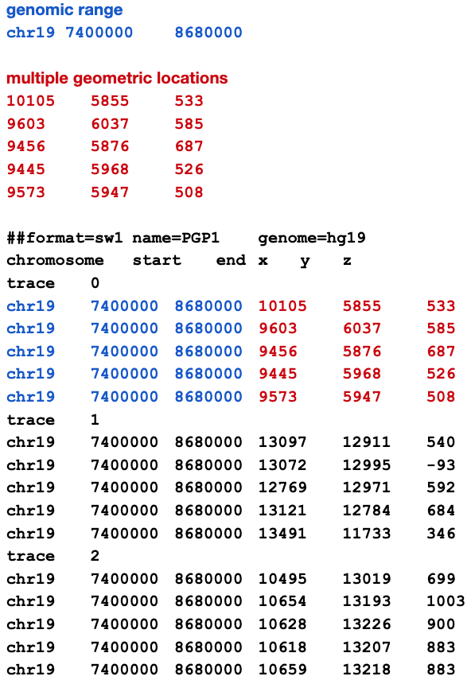

1st line \-- \#\#format directive followed by whitespace-delimited pairs of key-value properties

* Format specifier (required)
* Name (required)
* Genome identifier (required). UCSC or Genome Reference Consortium identifiers should be used when available (e.g. hg38, GRCh38)

2nd line \-- six (6) column headings, whitespace-delimited

Remaining lines \- blocks of trace data.   Each block begins with a “trace” line followed by data lines. All tokens are whitespace delimited (tab, space, etc.)

Example 1 \- Optical Reconstruction of Chromatin Architecture (ORCA) style data. Also called ball & stick data. Each data record lists a geometric location with an associated genomic range:

Example 2 \- OligoSTORM style data. Also called point cloud data. Similar to Example 1, each data record lists a geometric location with an associated genomic range.  The difference here is successive data records replicate the same genomic range but for a different geometric location:

